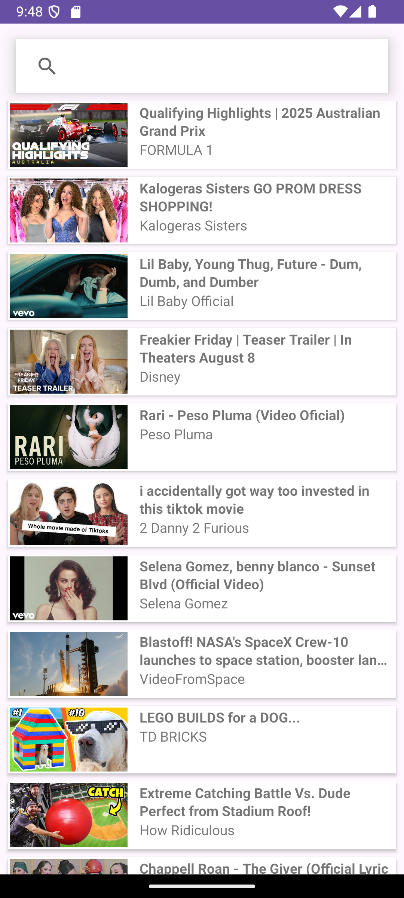
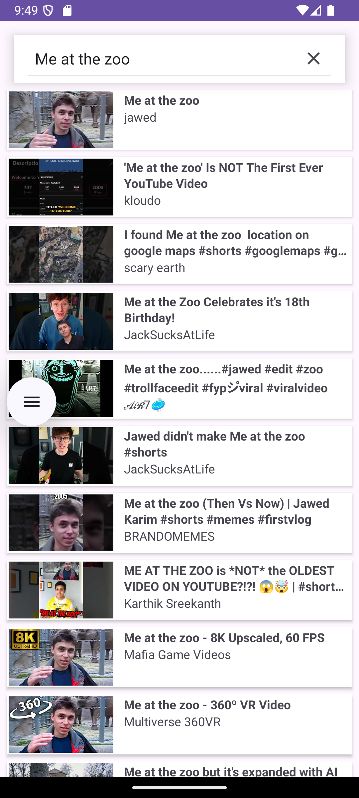
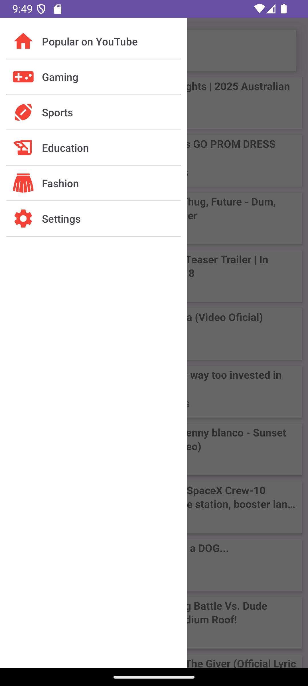
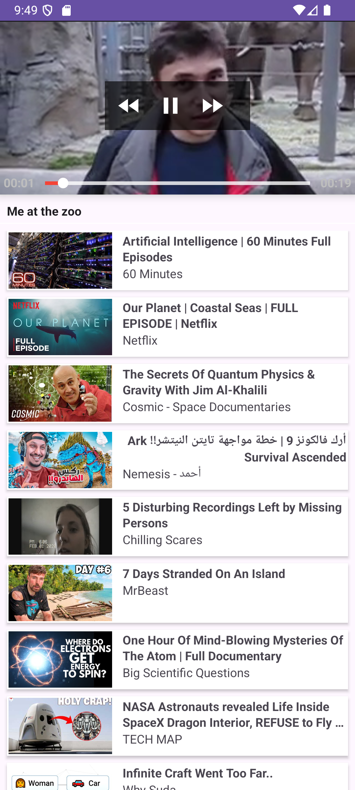

# TottalyKickAssTube

## Overview

**TotallyKickAssTube** is a totally kick ass YouTube client powered by YT-DLP (https://github.com/yausername/youtubedl-android. and Jackson.
Made to look roughly like a Material app (none of that Material bs, which to be fair I do find kind of cool maybe I'll make a fork with that design idk).

## YES I A KNOW I MISPLACED TotallyKickAssTube MANY TIMES MY BAD TOO LAZY TO FIX, I LOST MY MIND SORRY YA'LL

## Screenshots

Here are some screenshots showing off **TotallyKickAssTube**:


*Home Page - Main "Popular On YouTube Section"*


*Search Page - Search videos*


*Side Bar - Access different sections*


*Video Page - Watch videos*


*Video Player Fullscreen - Full screen player*

## Features

- **Watch Videos**: View YouTube videos directly within the app.
- **Related Videos**: Related videos work.
- **WebMs and MP4s**: You can choose between streaming with WebMs (VP9/OPUS), and MP4s (AVC1/ACC, and maybe AV1 soon?)

## Installation

- Are you stupid? It's just a normal app.

### Prerequisites

- Android 7.0 for now (Android 5.0 planned for the future)
- Internet connection 

### Steps to Build


1. **Clone the Repository:**
    ```bash
    git clone https://github.com/erievs/TotallyKickassTubeAndroid.git
    ```
2. **Open the Project** in Android Studio (or your IDE).

3. **Build & Run** the app on an emulator or a physical device.

### Dependencies

- **Jackson** (`com.fasterxml.jackson.core:jackson-databind`) for parsing JSON responses.
- **Retrofit** (`com.squareup.retrofit2:retrofit`) for API calls and network communication.
- **ExoPlayer** (`com.google.android.exoplayer:exoplayer`) makes my life super easy for unmuxed videos.
- **YouTubeDL-Android** (`io.github.junkfood02.youtubedl-android`) for getting videos from YouTube.
- **RxJava** (`io.reactivex.rxjava2:rxandroid`) for reactive programming and asynchronous handling.
- **Picasso** (`com.squareup.picasso:picasso`) for image loading and caching.
- **CardView** (`androidx.cardview:cardview`) for creating card-based UI components.
- **Material Components** (`com.google.android.material:material`) for Material Design components and UI elements.
- **Logging** (e.g., **Logcat**) for debugging and tracking issues.
-

## Contributing

I welcome contributions, if you really want to. Here’s how you can help:
- Fork the repository and clone it to your local machine.
- Create a new branch for your feature or bug fix.
- Commit your changes and push them to your fork.
- Open a pull request to merge your changes into the main repository.

I'd say ensure that your code follows the existing style, but I really have no style it is all crap,
just make sure it works and isn't malware and I'll probably merge. I don't care if Android Studio whines 
about the quality, this app is already programmed like crap anyways (probably ChatGPT could do better lol).

Don't care if you used ChatGPT or something, as long as it's only for programming/basic UX,
and you know it works.

DO NOT USE AI ICONS OR ANYTHING AT ALL FOR THE LOVE OF GOD

## License

This project is licensed under the GPLv3 License. See the [LICENSE](LICENSE.txt) file for more details.

---
